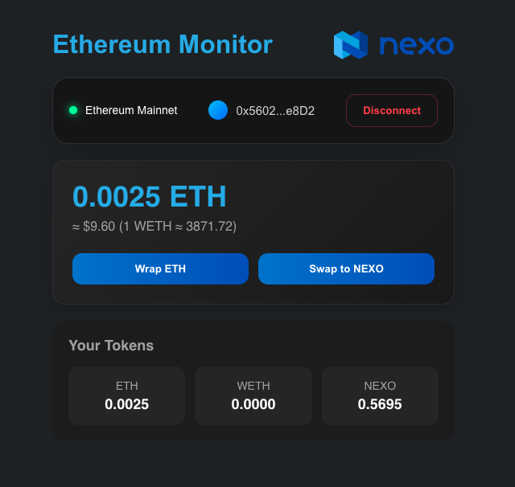

# Ethereum Wallet Interface

A modern React-based web interface for interacting with Ethereum wallets, tracking token balances, monitoring prices and executing token swaps via 1inch yield aggregation protocol.
This frontend application connects to a Node.js backend service that handles the 1inch API communication.




## Key Features

- Wallet connection via MetaMask
- Balance display for ETH, WETH and custom tokens (currently NEXO token is integrated)
- Real-time price monitoring of WETH
- ETH to WETH wrapping functionality
- WETH to NEXO token swapping via 1inch yield aggregator
- Network detection and validation
- Responsive, modern UI with modal dialogs

## Technologies Used

- React 19 (Functional components with hooks)
- Ethers.js 6 for blockchain interactions
- Axios for backend communication
- CSS for component styling
- 1inch Aggregation Protocol
- MetaMask Wallet Integration

## Prerequisites

- Node.js v19+
- npm v9+
- MetaMask browser extension
- Local or hosted backend service (see backend repo)
- 1inch API key (for the backend)

## Installation

1. Clone the repository:
   `git clone https://github.com/dobrygeorgiev/eth-monitor.git`
2. Navigate to project directory:
   `cd eth-monitor`
3. Install dependencies:
   `npm install`
4. Create `.env` file:
5. Configure environment variables (see next step)
6. Start development server:
   `npm start`


Additionally you can use the provided makefile for easier setup


   Install dependencies
`make install`

   Run development server
`make start`

   Build for production
`make build`

   Clean build artifacts
`make clean`

## Configuration

Required environment variables (`.env`):

- `REACT_APP_API_BASE_URL`: URL of backend service
  Example: `http://localhost:3001`

## Project Structure
```
eth-monitor
│ 
│ 
├── src/
│   ├── components/
│   │   ├── BalanceDisplay.jsx
│   │   ├── ConnectionButton.jsx
│   │   └── Modal.jsx
│   ├── utils/
│   │   ├── contracts.js
│   │   └── networks.js
│   ├── App.jsx
│   └── main.jsx
│
├── public/
│   ├── index.html
│   └── favicon.ico
│
├── App.js
├── index.js
├── .env
```

## Development Workflow

1. Start backend service (separate repo)
2. Run frontend: `npm start`
3. Access at: `http://localhost:{port}`
4. Use MetaMask to connect:
   - Ensure proper network is selected
   - Test with Sepolia testnet first
5. Test functionality:
   - ETH balance is displayed
   - WETH balance is displayed
   - NEXO balance is displayed
   - WETH price is displayed
   - Wrap ETH → WETH
   - Swap WETH → NEXO (Only working on Ethereum Mainnet)

## Testing Methodology

1. Manual Testing:  
   - Connecting
   - Disconnecting
   - Switching different networks
   - Wrapping ETH
   - Swapping WETH to NEXO
   - Edge cases (empty balances, failed txs)
   - Responsive design validation